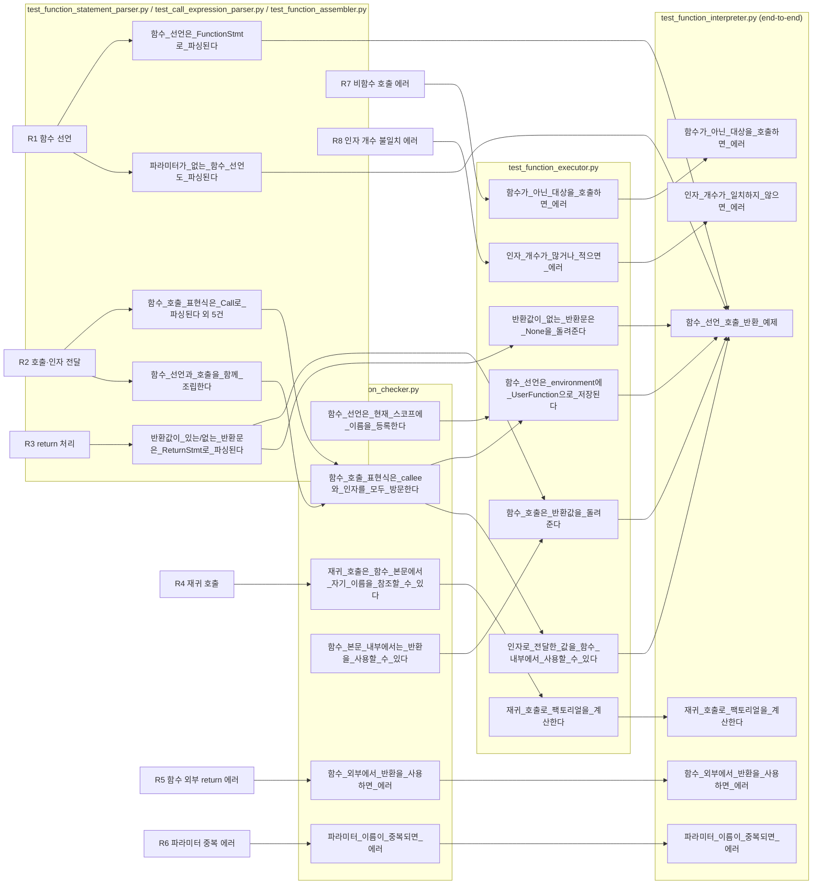

# 함수(Function) 기능 요구사항 추적성

`docs/reference/3일차_CodeFab Interpreter.pdf`의 "function 관련 요구사항"(p.6~7)에서
정의한 요구사항 8개(R1~R8)가 어떤 테스트로 검증되는지, 그리고 이를 구현하기 위해
추가된 클래스/메서드가 무엇인지 정리한다.

기존 `assembler.py` / `statement_parser.py` / `expression_parser.py` / `checker.py` /
`executor_unit.py` / `interpreter.py`는 한 줄도 수정하지 않았다. 모든 기능은 새 파일에
서브클래스로 추가하고, 각 클래스가 이미 `self.xxx()` 형태로 자기 자신의 메서드를 호출하는
지점(`_primary`, `_expression`, `parse_statement`, `_execute_stmt`, `_evaluate_expr`)만
오버라이드해서 끼워 넣었다 (다형성 기반 확장).

## 1. 요구사항 정의 (PDF p.6~7)

| ID | 요구사항 | 예시 |
|---|---|---|
| R1 | 함수 선언 | `함수 add(a, b) { ... }` |
| R2 | 함수 호출, 매개변수 전달 | `add(1, 2);` |
| R3 | return 처리 (값 없는 반환 → null / 값 있는 반환 → 대입) | `반환;` / `변수 ret = add(1,2);` |
| R4 | 재귀 호출 | `fact(n) { ... fact(n-1) ... }` |
| R5 | 함수 외부에서 return 사용 → 에러 | `반환 5;` (함수 밖) |
| R6 | 파라미터 이름 중복 → 에러 | `함수 foo(a, a) { ... }` |
| R7 | 함수가 아닌 대상 호출 → 에러 | `변수 x = "hello"; x();` |
| R8 | 인자 개수 불일치 → 에러 | `함수 foo(a,b,c){} foo(1,2);` |

## 2. 추적성 그래프

## 3. 요구사항 ↔ 테스트 매핑 표

| ID | 담당 계층 | 테스트 파일::테스트명 |
|---|---|---|
| R1 함수 선언 | Parser | `test_function_statement_parser.py::test_함수_선언은_FunctionStmt로_파싱된다`, `::test_파라미터가_없는_함수_선언도_파싱된다` |
| | Checker | `test_function_checker.py::test_함수_선언은_현재_스코프에_이름을_등록한다`, `::test_함수_이름이_같은_스코프에서_중복되면_에러` |
| | Executor | `test_function_executor.py::test_함수_선언은_environment에_UserFunction으로_저장된다` |
| | E2E | `test_function_interpreter.py::test_함수_선언_호출_반환_예제` |
| R2 호출·인자 전달 | Parser | `test_call_expression_parser.py` 전체, `test_function_statement_parser.py::test_함수_호출_표현식은_Call로_파싱된다` 외 `test_인자가_없는_함수_호출도_파싱된다`, `test_연쇄_호출도_파싱된다`, `test_function_assembler.py::test_함수_선언과_호출을_함께_조립한다` |
| | Checker | `test_function_checker.py::test_함수_호출_표현식은_callee와_인자를_모두_방문한다`, `::test_인자가_없는_호출도_에러_없이_방문된다` |
| | Executor | `test_function_executor.py::test_인자로_전달한_값을_함수_내부에서_사용할_수_있다`, `::test_클로저는_선언_당시의_environment를_기억한다` |
| | E2E | `test_function_interpreter.py::test_인자없이_호출하는_함수도_동작한다`, `::test_여러_함수를_선언하고_서로_호출할_수_있다`, `::test_영어_키워드로도_함수를_선언하고_호출할_수_있다` |
| R3 return 처리 | Parser | `test_function_statement_parser.py::test_반환값이_있는_반환문은_ReturnStmt로_파싱된다`, `::test_반환값이_없는_반환문은_value가_None이다` |
| | Checker | `test_function_checker.py::test_반환값이_있으면_그_표현식도_방문한다` |
| | Executor | `test_function_executor.py::test_함수_호출은_반환값을_돌려준다`, `::test_반환값이_없는_반환문은_None을_돌려준다`, `::test_본문에_반환문이_없으면_None을_돌려준다`, `::test_함수_호출_결과를_변수에_대입할_수_있다`, `::test_return_signal은_지정한_값을_보관한다` |
| R4 재귀 호출 | Checker | `test_function_checker.py::test_재귀_호출은_함수_본문에서_자기_이름을_참조할_수_있다`, `::test_중첩_함수_선언도_각자의_함수_depth를_올바르게_복원한다` |
| | Executor | `test_function_executor.py::test_재귀_호출로_팩토리얼을_계산한다` |
| | E2E | `test_function_interpreter.py::test_재귀_호출로_팩토리얼을_계산한다` |
| R5 함수 외부 return 에러 | Parser | `test_function_statement_parser.py::test_반환값이_없는_반환문은_value가_None이다` (구문 자체는 허용, 구조 검사는 Checker 담당) |
| | Checker | `test_function_checker.py::test_함수_외부에서_반환을_사용하면_에러`, `::test_함수_본문_내부에서는_반환을_사용할_수_있다`(음성 대조군) |
| | E2E | `test_function_interpreter.py::test_함수_외부에서_반환을_사용하면_에러` |
| R6 파라미터 중복 에러 | Parser | `test_function_statement_parser.py::test_파라미터_이름_자리에_잘못된_토큰이_오면_에러` (구문 형태 검사) |
| | Checker | `test_function_checker.py::test_파라미터_이름이_중복되면_에러` |
| | E2E | `test_function_interpreter.py::test_파라미터_이름이_중복되면_에러` |
| R7 비함수 호출 에러 | Executor | `test_function_executor.py::test_함수가_아닌_대상을_호출하면_에러` |
| | E2E | `test_function_interpreter.py::test_함수가_아닌_대상을_호출하면_에러` |
| R8 인자 개수 불일치 에러 | Executor | `test_function_executor.py::test_인자_개수가_파라미터보다_적으면_에러`, `::test_인자_개수가_파라미터보다_많으면_에러` |
| | E2E | `test_function_interpreter.py::test_인자_개수가_일치하지_않으면_에러` |

기타 회귀 방지용 테스트(요구사항에는 없지만 "기존 동작을 깨지 않는지" 검증):
`test_call_expression_parser.py::test_괄호가_뒤따르지_않는_식별자는...`,
`::test_기존_이항_연산_파싱_동작도_그대로_유지된다`,
`test_function_statement_parser.py::test_함수가_아닌_기존_문장도_여전히_파싱된다`,
`test_function_executor.py::test_기존_리터럴_이항연산_출력_동작은_그대로_유지된다`.

## 4. 추가된 클래스 / 메서드 정리

### 4.1 AST 노드 — `codefab/ast_nodes.py` (기존 파일 끝에 추가)

| 클래스 | 필드 | 역할 |
|---|---|---|
| `Call(Expr)` | `callee`, `paren`, `arguments` | 함수 호출 표현식. `paren`은 에러 라인 리포팅용 |
| `FunctionStmt(Stmt)` | `name`, `params`, `body` | 함수 선언문 |
| `ReturnStmt(Stmt)` | `keyword`, `value` | 반환문. `value`가 `None`이면 값 없는 `반환;` |

### 4.2 Assembler Unit (신규 파일)

| 파일 | 클래스 | 메서드 | 역할 |
|---|---|---|---|
| `assembler/call_expression_parser.py` | `CallExpressionParser(ExpressionParser)` | `_primary()` (오버라이드) | 기존 `_primary` 결과에 후행 호출을 이어붙임 |
| | | `_finish_calls(callee)` | `add()(1)`처럼 연쇄 호출을 while로 처리 |
| | | `_finish_call(callee)` | `(`부터 인자 목록을 파싱해 `Call` 생성 |
| `assembler/function_statement_parser.py` | `FunctionStatementParser(StatementParser)` | `parse_statement()` (오버라이드) | `FUN`/`RETURN` 토큰이면 새 파싱, 아니면 `super()`에 위임 |
| | | `_function_declaration()` | `함수 이름(파라미터...) { 본문 }` 파싱 |
| | | `_return_statement()` | `반환 [표현식];` 파싱 |
| | | `_expression()` (오버라이드) | 내부적으로 `CallExpressionParser`를 사용하도록 교체 |
| `assembler/function_assembler.py` | `FunctionAssembler(Assembler)` | `assemble()` (오버라이드) | `FunctionStatementParser`로 조립하는 Assembler |

### 4.3 Checker Unit (신규 파일)

| 파일 | 클래스 | 메서드 | 역할 |
|---|---|---|---|
| `function_checker.py` | `FunctionChecker(Checker)` | `__init__()` | `function_depth` 카운터 추가 |
| | | `visit_function_stmt(stmt)` | 함수명 중복(R1)·파라미터 중복(R6) 검사, 새 스코프 push 후 본문 검사, `function_depth` 증가/복원 |
| | | `visit_return_stmt(stmt)` | `function_depth == 0`이면 R5 에러, 아니면 반환값 방문 |
| | | `visit_call(expr)` | callee와 인자 표현식을 모두 방문(R2) |

### 4.4 Executor Unit (신규 파일)

| 파일 | 클래스 | 메서드 | 역할 |
|---|---|---|---|
| `function_executor.py` | `ReturnSignal(Exception)` | `__init__(value)` | `반환`을 함수 호출 지점까지 되감는 내부 제어 흐름 예외 |
| | `UserFunction` | `arity` (property) | 선언된 파라미터 개수 |
| | | `call(arguments)` | 새 `Environment`(closure 기준)에 인자 바인딩 후 본문 실행, `ReturnSignal` 캐치해 값 반환(R3, R4) |
| | `FunctionExecutorUnit(ExecutorUnit)` | `_execute_stmt(statement)` (오버라이드) | `FunctionStmt`→`UserFunction` 정의, `ReturnStmt`→`ReturnSignal` 발생, 그 외 `super()` 위임 |
| | | `_evaluate_expr(expression)` (오버라이드) | `Call`이면 `_evaluate_call`, 그 외 `super()` 위임 |
| | | `_evaluate_call(expression)` | callee 평가 후 호출 가능 여부(R7)·인자 개수(R8) 검사, `UserFunction.call()` 실행 |

### 4.5 조립 지점 (신규 파일)

| 파일 | 함수 | 역할 |
|---|---|---|
| `function_interpreter.py` | `create_function_interpreter()` | `FunctionAssembler` + `FunctionChecker` + `FunctionExecutorUnit`을 조립한 `Interpreter` 생성 |

### 4.6 기존 공유 파일에 추가된 항목 (라인 추가만, 기존 라인 변경/삭제 없음)

| 파일 | 추가 내용 |
|---|---|
| `tokens.py` | `TokenType.COMMA`, `TokenType.FUN`, `TokenType.RETURN` |
| `tokenizer.py` | `SINGLE_CHAR_TOKENS`에 `","`, `KEYWORDS`에 `func`/`함수`, `return`/`반환` |
| `error.py` | `DuplicateParameterError`, `ReturnOutsideFunctionError` (Checker), `NotCallableError`, `ArgumentCountMismatchError` (Executor) |
